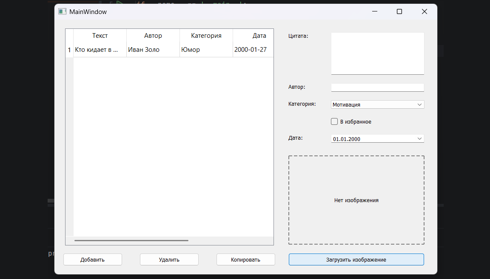
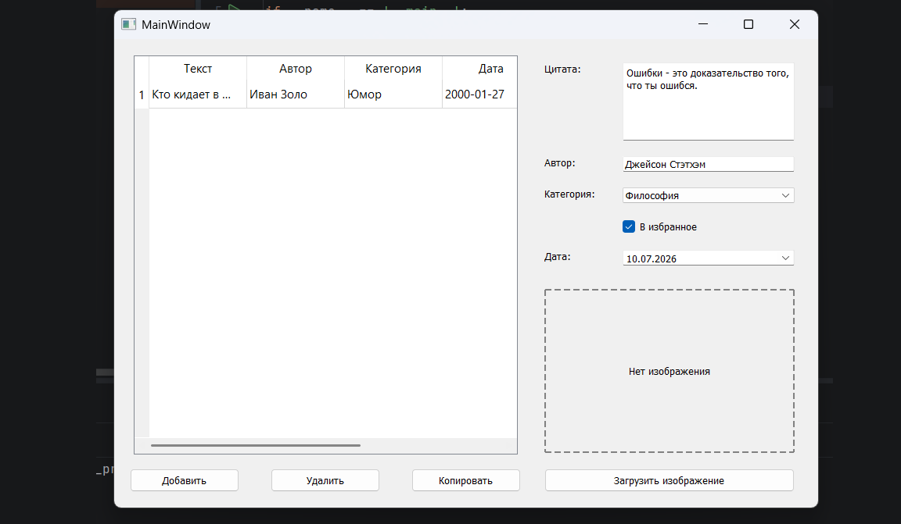
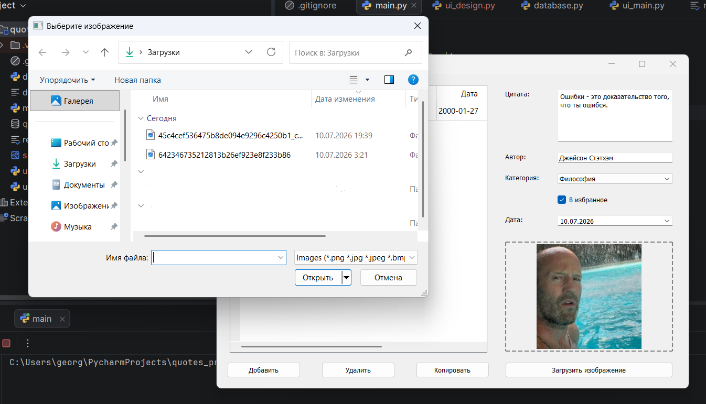

# PyQt5 Practice: Коллекция цитат

## Запуск проекта

1. Создайте виртуальное окружение:  `python -m venv venv`

2. Активируйте:
   - Windows:  `venv\Scripts\activate`
   - macOS/Linux:  `source venv/bin/activate`

3. Установите зависимости:  `pip install -r requirements.txt`

4. Сгенерируйте интерфейс:  `pyuic5 design.ui -o ui_design.py`

5. Запустите:  `python main.py`

---

## Структура проекта

- `main.py` → Точка входа, настройка QApplication
- `ui_main.py` → Интерфейс, сигналы, обработка событий
- `database.py` → Работа с SQLite (CRUD)
- `ui_design.py` → Интерфейс из Qt Designer
- `design.ui` → Файл дизайна (Qt Designer)
- `requirements.txt` → Список зависимостей

---

## Описание работы

Приложение создано для хранения цитат. Можно добавлять текст цитаты, автора, категорию, дату, отмечать как избранное. Также есть возможность загружать портрет автора (или что-нибудь другое), но она не отобразится в таблице. Все данные сохраняются в базе данных SQLite.

Для работы с изображениями используется библиотека Pillow. Изображение открывается, масштабируется до размера 200x200 и отображается в интерфейсе.

---

## Примеры использования

Добавление новой цитаты:

1. Введите текст цитаты в поле "Цитата".
2. Введите имя автора в поле "Автор".
3. Выберите категорию из выпадающего списка.
4. Если нужно отметьте "В избранное".
5. Нажмите кнопку "Добавить".

Цитата появится в таблице.

Копирование цитаты в буфер обмена:

1. Выделите строку с цитатой в таблице.
2. Нажмите кнопку "Копировать".
3. Цитата скопируется в формате: "Текст" — Автор.

Удаление цитаты:

1. Выделите строку с цитатой в таблице.
2. Нажмите кнопку "Удалить".
3. Подтвердите удаление.

Загрузка изображения:

1. Нажмите кнопку "Загрузить изображение".
2. Выберите файл (png, jpg, jpeg, bmp).
3. Изображение отобразится в правой части окна.

---

## Иллюстрации

Пустой нтерфейс приложения:

Пример добавления новой цитаты:

Загрузка изображения:

---

## Автор

ФИО: Кемайкин Георгий Романович

Группа: ФМ-14-25

Вариант: 57 - Коллекция цитат

Преподаватель: Сидорова Елена Борисовна

## Технологии

Python 3.10, PyQt5, SQLite3, Pillow, Qt Designer, Git
